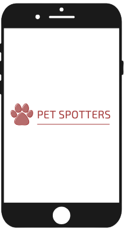

# 2021.2-PetSpotters

# Sobre o projeto PetSpotters

O projeto PetSpotters se preocupa com a qualidade da vida daqueles que prestamos tantos sentimentos, nos proporcionam muitos bons momentos e são nossos amigos e leais companheiros... são eles nossos queridos pets! 🐶🐱🐰

Infelizmente muitos desses bichos que nos oferecem tanta afetividade sofrem pelo fato de ficarem "largados" dentro de casa ou trancados por muito tempo, muitas vezes pela falta de disponibilidade de seu dono(a) ou até mesmo irresponsabilidade. Esse cenário contribui para a baixa qualidade de vida desses pets, pois não interagem com outros animais ou pessoas e o resultado disso são problemas de saúde e distúrbios comportamentais desses animais.

Felizmente, o projeto PetSpotters surgiu para mudar toda essa história e ajudar esses pets! 😀

O propósito do PetSpotters é prover aos pets interações sociais, as quais são essenciais para a bem estar e saúde dos animais. Para isso, nada melhor que um aplicativo que promove esses relacionamentos na palma da sua mão! 

  

# Membros
| [Arthur Talles](https://github.com/art1505) | [Antônio Neto](https://github.com/antoniotoineto) | [Herick Lima](https://github.com/hericklima22) | [Isadora Galvão](https://github.com/isadoragalvaoss) | [Levi Queiroz](https://github.com/LeviQ27) |
| --- | --- | --- | --- | --- |
 |  |  |  |  |

# Matrículas
| Nome | Matrícula |
|---------------------------| ---------- |
| <a href="https://github.com/art1505">Arthur Talles de Sousa Cunha</a>             | 19/0054832 |
| <a href="https://github.com/antoniotoineto">Antônio Ferreira de Castro Neto</a>   | 19/0044799 |
| <a href="https://github.com/hericklima22">Herick de Carvalho Lima</a>             | 18/0121995 |
| <a href="https://github.com/isadoragalvaoss">Isadora Galvão</a>                   | 18/0122606 |
| <a href="https://github.com/LeviQ27">Levi de Oliveira Queiroz</a>                 | 17/0108341 |

