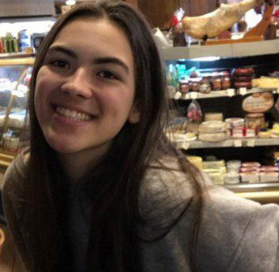

# 2021.2-PetSpotters
# Membros
| [Arthur Talles](https://github.com/art1505) | [Antônio Neto](https://github.com/antoniotoineto) | [Herick Lima](https://github.com/hericklima22) | [Isadora Galvão](https://github.com/isadoragalvaoss) | [Levi Queiroz](https://github.com/LeviQ27) |
| --- | --- | --- | --- | --- |
 |  |  |  |  |

# Matrículas
| Nome | Matrícula |
|---------------------------| ---------- |
| <a href="https://github.com/art1505">Arthur Talles de Sousa Cunha</a>             | 19/0054832 |
| <a href="https://github.com/antoniotoineto">Antônio Ferreira de Castro Neto</a>   | 19/0044799 |
| <a href="https://github.com/hericklima22">Herick de Carvalho Lima</a>             | 18/0121995 |
| <a href="https://github.com/isadoragalvaoss">Isadora Galvão</a>                   | 18/0122606 |
| <a href="https://github.com/LeviQ27">Levi de Oliveira Queiroz</a>                 | 17/0108341 |

