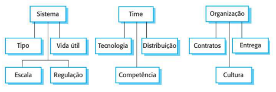

# Desenvolvimento de Software
## 2.1 Questões levantadas para a decisão do Desenvolvimento de Software

Segundo Ian Sommerville, para decidir o equilíbrio entre uma abordagem ou outra, é preciso pensar em uma série de fatores que se dividem em **3 naturezas diferentes**:

### 2.1.1 <b> Questões técnicas </b>: Se relacionam com o sistema que está sendo desenvolvido
<table>
  <tr>
    <td> <b> Sistema </b> </td> 
    <td> Qual é o tamanho do sistema que está sendo desenvolvido? 
    - Se trata de um sistema de relacionamento de pets, voltado para donos do pets. Portanto, não é um sistema muito robusto </td>
  </tr>
  <tr>
    <td> <b> Tipo </b> </td> 
    <td> Que tipo de sistema está sendo desenvolvido? - Aplicativo de celular </td>
  </tr>
  <tr>
    <td> <b> Vida útil </b> </td> 
    <td> Qual é a vida útil prevista para o sistema? - O produto possui vida útil indeterminada, enquanto houver público (donos de pets) e o problema em questão </td>
  </tr>
</table>

### 2.1.2 <b> Questões humanas </b>: Se relacionam com o time no desenvolvimento
<table>
  <tr>
    <td> <b> Time </b> </td> 
    <td> Qual é o nível de competência dos projetistas e 
    programadores do time de desenvolvimento? - O time se trata de um conjunto de estudantes de Engenharia de Software, todos com experiência em desenvolvimento ágil </td>
  </tr>
  <tr>
    <td> <b> Distribuição </b> </td> 
    <td> Como está organizado o time de desenvolvimento? - O time está organizado em 5 integrantes. Vale destacar 1 desenvolvedora Front-end e 1 dev com experiência em desenvolvimento Mobile  </td>
  </tr>
  <tr>
    <td> <b> Tecnologia </b> </td> 
    <td>  Quais são as tecnologias disponíveis para apoiar o 
    desenvolvimento do sistema? - Experiência em React e React Native </td>
  </tr>
</table>

### 2.1.3 <b> Questões organizacionais </b>: Se relacionam com a organização que estão desenvolvendo
<table>
  <tr>
    <td> <b> Contrato </b> </td> 
    <td>  É importante ter uma especificação e um projeto (design) 
    bem detalhados antes de passar para a implementação,
    talvez por motivos contratuais? - Pelo fato do projeto não englobar um contrato formal, não é necessário uma especificação ou projeto(design) bem detalhado </td>
  </tr>
  <tr>
    <td> <b> Entrega </b> </td> 
    <td> É realista uma estratégia de entrega incremental, na qual o 
    software é entregue aos clientes ou outros stakeholders e 
    um rápido feedback é obtido? - A entrega incremental é totalmente viável, por ser possível um feedback rápido em contato com o cliente (dono de pet) </td>
  </tr>
  <tr>
    <td> <b> Clientes </b> </td> 
    <td> Os representantes do cliente estarão disponíveis e 
    dispostos a participar do time de desenvolvimento? - Os clientes poderão estar em contato com o time de desenvolvimento para constantes melhorias no projeto </td>
  </tr>
  <tr>
    <td> <b> Cultura </b> </td> 
    <td> Existem questões culturais que possam afetar o 
    desenvolvimento do sistema? - As diferenças culturais não irão interferir no desenvolvimento do projeto </td>
  </tr>
</table>
<!---
Conectem essas suas subseções. Como os fatores acima ajudam a fundamentar a escolha de metodologia que vcs apresentam, a seguir? Vi que falam do Sommerville, mais abaixo, mas tentem conectar as informações desde já.
-->

## 2.2 Metodologia baseada no Scrum

Dadas as questões levantadas, e como base os conceitos de Sommerville, decidimos adotar um sistema ágil baseado no Scrum, e dessa forma, podemos gerenciar nosso projeto baseado em vários conceitos positivos para nós, como a entrega incremental, adaptabilidade a mudanças e flexibilidade de requisitos, visto que nossas questões técnicas, humanas e organizacionais são compatíveis com uma abordagem ágil.

Além disso, nos escoramos em outros conceitos de Ian Sommerville de seu livro “Engenharia de Software". Em seu trabalho, destaca a fase central do Scrum, chamada ciclos de sprint, como a mais inovadora característica de tal abordagem. "Um sprint do Scrum é uma unidade de planejamento na qual o trabalho a ser feito é avaliado, os recursos para o desenvolvimento são selecionados e o software é implementado".

Outro fator levantado por Sommerville e que possuiu certo peso em nossa decisão foi a descentralização do poder de decisões. Toda a equipe tem poder para tomar decisões, sendo o Scrum Master apenas um vetor de fluidez para o andamento do projeto: “A ideia por trás do Scrum é que toda a equipe deve ter poderes para tomar decisões, de modo que o termo ‘gerente de projeto’ tem sido deliberadamente evitado. Pelo contrário, o ‘Scrum Master’ é um facilitador, que organiza reuniões diárias, controla o backlog de trabalho, registra decisões, mede o progresso comparado ao backlog e se comunica com os clientes e a gerência externa à equipe”. 

Além do SM, nossa abordagem de desenvolvimento de software contará com o Product Owner e o Dev Team, que serão papéis rotativos entre os integrantes do projeto. 

Nosso modelo irá contar com os seguintes eventos e artefatos:

    • Sprints

    • Sprint Planning/Review

    • Sprint Retrospective

    • Reuniões Semanais

    • Product Backlog

    • Sprint Backlog

Portanto, decidimos nos basear no Scrum, pelos diversos fatores que nos beneficiam em aspectos de flexibilidade, entrega, feedback contínuo, descentralização de poder e dinamismo.
