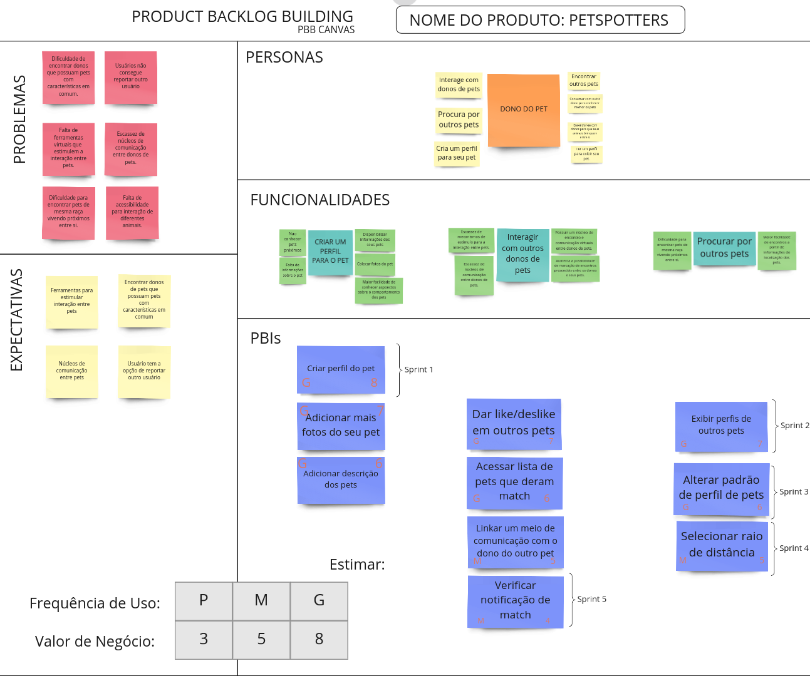

# PBB

O Product Backlog Building (PDD) é um método que facilita a elaboração e a criação de um Product Backlog.

## Objetivos

- Ajudar na construção de um BACKLOG de um
  forma efetiva e colaborativa.
- Construir um entendimento compartilhado do
  negócio do cliente, facilitando a descoberta e
  compreensão do produto.
- Buscar uma maneira de descrever a experiência
  do usuário com o produto.
- Facilitar a descoberta e escrita de User Stories.
- Priorizar por alinhamento de expectativas e
  metas.
- Ter como resultado um Product Backlog
  totalmente alinhado com o valor de negócio do
  cliente

