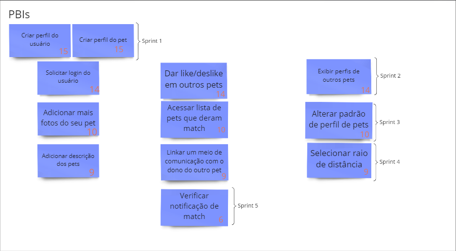

# PBB

O Product Backlog Building (PDD) é um método que facilita a elaboração e a criação de um Product Backlog.

## Objetivos

- Ajudar na construção de um BACKLOG de um
  forma efetiva e colaborativa.
- Construir um entendimento compartilhado do
  negócio do cliente, facilitando a descoberta e
  compreensão do produto.
- Buscar uma maneira de descrever a experiência
  do usuário com o produto.
- Facilitar a descoberta e escrita de User Stories.
- Priorizar por alinhamento de expectativas e
  metas.
- Ter como resultado um Product Backlog
  totalmente alinhado com o valor de negócio do
  cliente
  
## Modificações

- Estabelecida a correspondência entre os problemas relativos ao contexto do produto atual e os que as funcionalidades visam resolver.
- Tendo em vista a necesssária relação entre as funcionalidades do PBB e do Canvas MVP, anteriormente realizado, acrescentamos alguns PBI´s a mais para que tal relação se concretizasse em sua totalidade.

<a href="https://miro.com/app/board/uXjVOKrgeb4=/">Link para o PBB Canvas </a>

## COORG

**COORG** é uma técnica eficiente para realizar a priorização de backlog, visando planejar e alinhar o fluxo de trabalho e as próximas sprints.
Assim, foi aplicado o COORG para classificar, ordernar e organizar as funcionalidades e os PBI's.

Os critérios de classificação foram:

<!--
- **Frenquência de Uso**

<table>
<tr>
        <td > G </td>
        <td>Realizado sempre ou quase sempre que o usuário entra na plataforma</td>
</tr>
<tr>
        <td> M </td>
        <td> Realizado de vez em quando, em um intervalo entre uma semana ou duas semanas </td>
</tr>
<tr>
        <td> P </td>
        <td>Realizado de raramente, um intervalo de 1 ou mais meses dentro da plataforma</td>
</tr>
<caption>Legenda</caption>
</table>
 
-->
- ## **Escala de valores**
 ### **Prioridade de uso: Dependência  + valor de negócio**

###  Valor de negócio
<table>
<tr>
        <td > 2 </td>
        <td>Algo que faz sentido, mas que não agrega muito valor no momento atual, um valor de negócio baixo.</td>
</tr>
<tr>
        <td> 5 </td>
        <td> Algo que possui certo grau de importância, um valor de negócio médio. </td>
</tr>
<tr>
        <td> 8 </td>
        <td> Muito importante, principal, algo com um valor de negócio alto. </td>
</tr>

</table>
- : 
- (): 
- (): 
- (): 
- (7): 

###  Dependências
<table>
<tr>
        <td > Menor que 4 </td>
        <td> Exerce pouca dependência em relação às demais. Desconsiderado no processo de priorização.</td>
</tr>
<tr>
        <td> 4 </td>
        <td> Exerce menos dependência em relação às demais. Possui menor relevância em relação às outras, mas ainda agrega valor ao projeto. </td>
</tr>
<tr>
        <td> 5 </td>
        <td> Exerce dependência intermediária em relação às demais . Possui certo grau de relevância, mas faz parte de uma cadeia menor de importância em relação às anteriormente realizadas. </td>
</tr>
<tr>
        <td> 6 </td>
        <td> Exerce forte dependência em relação às demais. Outras funcionalidades podem ser implementadas antes, mas esta ainda estabelece elevado grau de importância em relação às outras. </td>
</tr>
<tr>
        <td> 7 </td>
        <td> Essencial para a realização das demais. Todos os demais PBI's necessitam da implementação deste. </td>
</tr>

</table>

# Critérios de Aceitação das US's

Os critérios de aceitação de todas as User Stories podem ser visualizados através do link abaixo da imagem.

[Link para os critérios de aceitação](https://docs.google.com/spreadsheets/d/1SRrwxA64Fazjc2veKSibC7b3Cy8kGOiDQO4Pd-se34Y/edit?usp=sharing)