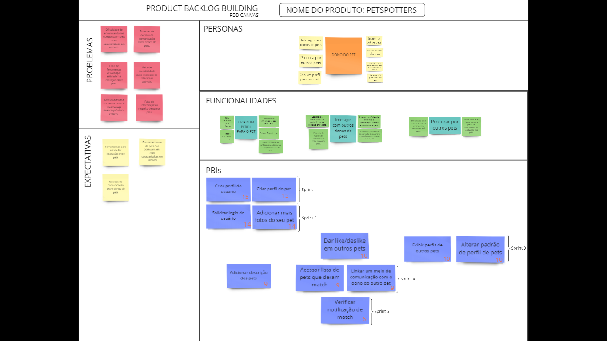
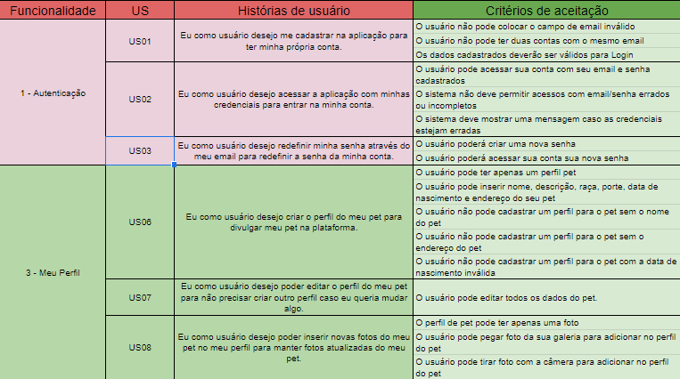

# PBB

O Product Backlog Building (PDD) é um método que facilita a elaboração e a criação de um Product Backlog.

## Objetivos

- Ajudar na construção de um BACKLOG de um
  forma efetiva e colaborativa.
- Construir um entendimento compartilhado do
  negócio do cliente, facilitando a descoberta e
  compreensão do produto.
- Buscar uma maneira de descrever a experiência
  do usuário com o produto.
- Facilitar a descoberta e escrita de User Stories.
- Priorizar por alinhamento de expectativas e
  metas.
- Ter como resultado um Product Backlog
  totalmente alinhado com o valor de negócio do
  cliente
  
## Modificações

- Estabelecida a correspondência entre os problemas relativos ao contexto do produto atual e os que as funcionalidades visam resolver.
- Tendo em vista a necesssária relação entre as funcionalidades do PBB e do Canvas MVP, anteriormente realizado, acrescentamos alguns PBI´s a mais para que tal relação se concretizasse em sua totalidade.

<!--
## COORG

**COORG** é uma técnica eficiente para realizar a priorização de backlog, visando planejar e alinhar o fluxo de trabalho e as próximas sprints.
Assim, foi aplicado o COORG para classificar, ordernar e organizar as funcionalidades e os PBI's.

Os critérios de classificação foram:

- **Frenquência de Uso**

<table>
<tr>
        <td > G </td>
        <td>Realizado sempre ou quase sempre que o usuário entra na plataforma</td>
</tr>
<tr>
        <td> M </td>
        <td> Realizado de vez em quando, em um intervalo entre uma semana ou duas semanas </td>
</tr>
<tr>
        <td> P </td>
        <td>Realizado de raramente, um intervalo de 1 ou mais meses dentro da plataforma</td>
</tr>
<caption>Legenda</caption>
</table>
 

- **Relevância**

<table>
<tr>
        <td > 8 </td>
        <td>Muito relevante. Todos os demais PBI's necessitam da implementação deste.</td>
</tr>
<tr>
        <td> 7 </td>
        <td> Muito Relevante. Outras funcionalidades podem ser implementadas antes, mas esta   ainda estabelece elevado grau de importância em relação às outras. </td>
</tr>
<tr>
        <td> 6 </td>
        <td> Relevante. Ainda que boa parte tenha sido implementada, esta estabelece   influência sobre as subsequentes </td>
</tr>
<tr>
        <td> 5 </td>
        <td> Intermediário. Possui certo grau de relevância, mas faz parte de uma cadeia menor   de importância em relação às anteriormente realizadas. </td>
</tr>
<tr>
        <td> 4 </td>
        <td> Menos relevante. Possui menor relevância em relação às outras, mas ainda agrega   valor ao projeto. </td>
</tr>
<caption>Legenda</caption>
</table>
-->

<a href="https://miro.com/app/board/uXjVOKrgeb4=/">Link para o PBB Canvas </a>

# Critérios de Aceitação das US's

Os critérios de aceitação de todas as User Stories podem ser visualizados através do link abaixo da imagem.

[Link para os critérios de aceitação](https://docs.google.com/spreadsheets/d/1SRrwxA64Fazjc2veKSibC7b3Cy8kGOiDQO4Pd-se34Y/edit?usp=sharing)