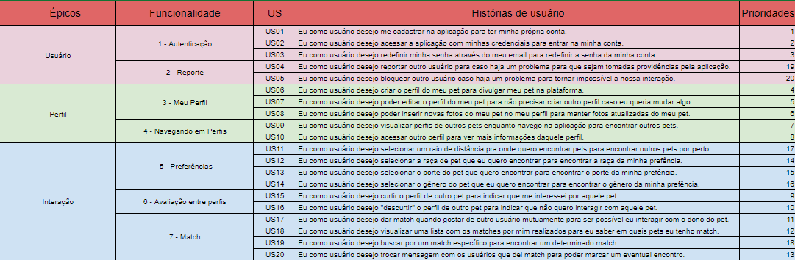

# Visão Geral do Produto

 

## 1.1 Declaração do problema

 
<table>
  <tr>
    <td> <b> O problema </b> </td> 
    <td>Os pets que sofrem distúrbios comportamentais e problemas de saúde causado pela falta de interação com outros animais ou pessoas. </td>
  </tr>
  <tr>
    <td> <b> Afeta </b> </td> 
    <td>Os pets que não possuem essas interações saudáveis, e acabam desenvolvendo comportamentos anormais e problemas de saúde como depressão ou ansiedade.</td>
  </tr>
  <tr>
    <td> <b> Cujo impacto é </b> </td> 
    <td>Uma má qualidade de vida do animal, que irá resultar num mal relacionamento entre o pet e seu dono.<td>
  </tr>
  <tr>
    <td> <b> Uma solução de sucesso seria </b> </td> 
    <td>Um aplicativo que possibilita a conexão entre donos de pets de uma determinada localidade. Dessa forma, os donos de pets podem combinar um encontro junto com seus pets, e finalmente, gerar uma interação saudável entre esses animais, evitando os problemas citados acima.</td>
  </tr>
</table>

 

## 1.2 Declaração de Posição do Produto

 
<table>
  <tr>
    <td> <b> Para </b> </td> 
    <td> Os donos com pets que sofrem dos problemas advindos da falta de interação dos seus pets com outros animais ou pessoas.
  </tr>
  <tr>
    <td> <b> Cujo impacto é </b> </td> 
    <td> Criar relações saudáveis entre os pets.
    </td>
  </tr>
  <tr>
    <td> <b> O Petspotters </b> </td> 
    <td>é uma rede social que conecta os donos de pets, para que esses donos promovam interações saudáveis entre seus pets. </td>
  </tr>
  <tr>
    <td> <b> Ao contrário </b> </td> 
    <td>do PetPonto, que o foco é em adoção e do CruzaPet, que o foco é reprodução</td>
  </tr>
  <tr>
    <td> <b> Nosso produto </b> </td> 
    <td> permite que os donos de pets possam cadastrar os seus pets no aplicativo, entre várias opções possam escolher outro pet e assim depois de darem match, possam marcar um encontro para que esses pets se conheçam, interajam e assim criem uma relação, melhorando a vida social dos dois e mais pets. </td>
  </tr>
</table>

 

## 1.3 Objetivos do Produto

 

O objetivo principal do PetSpotters é que os donos de pets melhorem a vida social dos seus pets e fazer com que eles interajam com outros pets, tanto para passarem um dia no parque brincando, quanto para reproduzirem e gerarem lindos filhotes. E além disso, a rede de relacionamento acaba se estendendo para os donos também pois como são eles que administram as contas, indiretamente acabam conhecendo outros donos.

## 1.4 Escopo do Produto

 

### 1.4.1 Requisitos funcionais
- [RF01] O sistema deverá permitir o cadastro do usuário
- [RF02] O sistema deverá solicitar login para o acesso
- [RF03] O sistema deverá permitir a redefinição de senha
- [RF04] O sistema deverá prover um perfil ao usuário
- [RF05] O sistema deverá permitir a edição do perfil do usuário
- [RF06] O sistema deverá permitir a inserção de novas fotos do pet do usuário
- [RF07] O sistema deverá permitir a alteração de preferências de localização, raça, porte e gênero dos pets
- [RF08] O sistema deverá exibir um perfil para o usuário decidir se possui ou não interesse no pet
- [RF09] O sistema deverá dar um match quando dois usuários gostarem do pet um do outro
- [RF10] O sistema deverá exibir uma lista com os matches do usuário
- [RF11] O sistema deverá permitir que o usuário busque por um match específico
- [RF12] O sistema deverá permitir que os usuários que derem match troquem mensagens entre si
- [RF13] O sistema deverá permitir que um usuário reporte o outro caso haja algum problema

### 1.4.2 Requisitos não funcionais 

- [RNF01] O app deverá estar disponível 24 horas, 7 dias por semana, ou o mais próximo possível disso
- [RNF02] O app deverá ser compatível com a plataforma Android 
- [RNF03] O app deverá proporcionar segurança ao guardar os dados do usuário
- [RNF04] O app deverá apresentar linguagem de fácil entendimento
- [RNF05] O app deverá respeitar e seguir normas nacionais que dizem respeito à elaboração, desenvolvimento e comercialização de aplicativos, tais como a Lei de Proteção da Propriedade Intelectual de Programas de Computador (Lei nº 9.609, de 19 de fevereiro de 1998) e a Lei de Propriedade Industrial (Lei nº 9.270, de 14 de maio de 1996)
- [RNF06] O app deverá possuir interface intuitiva e de fácil compreensão
- [RNF07] O app deverá apresentar um layout responsivo
- [RNF08] O sistema não apresentará aos usuários quaisquer dados de cunho privativo 
- [RNF09] O sistema deverá ser desenvolvido na linguagem Javascript juntamente com o framework de desenvolvimento mobile React Native, para o front-end. Para o back-end, o sistema deverá ser desenvolvido com o auxílio das tecnologias NodeJS e rest API axios.
- [RNF10] O sistema deverá fazer uso das tecnologias Firebase e Docker para o processo de implementação
- [RNF11] Deverá ser realizado um relatório de acompanhamento semanalmente

 

## 1.5 Requisitos com padrão SAFe
<!--
### Comentários do professor: 
Essa estrutura precisa ser revista. Existem vários relacionamentos 1..1 entre features e histórias. Por favor, corrijam

OBS: As mudanças foram os valores de negócios e coluna US foi trocada de lugar
-->

<a href="https://docs.google.com/spreadsheets/d/1-uMMVV517KptQm8iZ8H7HGmlVPqYcNHyairslKIF8ZA/edit#gid=0">Link para o SAFe</a>

## 1.6 Mínimo Produto Viável (MVP)

## Canvas MVP

O Canvas MVP da plataforma PetStoppers foi realizado e obtivemos a seguinte configuração incial:
<!--
### Comentários do professor:
A jornada refere-se ao que a persona faz, atualmente, e não o que ela irá fazer com a utilização da solução. Nesse momento, não se tem nem os requisitos funcionais. Esses são extraídos, justamente, das jornadas

A nomemclatura e conteúdo de fundionalidades está diferente da seção 1.4.1. Requisitos Funcionais do documento de Visão.

cada resultado esperado deve ser passível de mensuração. Como mensurar, por exemplo, "Melhorar vida social dos pets"?

OBS: O que mudou aqui foi as JORNADAS
-->

<a href="https://miro.com/app/board/uXjVOKrgeb4=/">Link para o Canvas</a>
