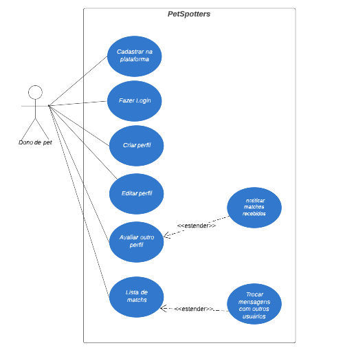

# Casos de Uso
## Histórico de revisão
| Data       | Autor                                        | Modificações                      | Versão |
| ---------- | -------------------------------------------- | --------------------------------- | ------ |
| 20/04/2022 | [antoniotoineto](https://github.com/antoniotoineto) | Adicionando modelo de caso de uso | 1.0 |
| 26/04/2022 | [art1505](https://github.com/art1505) | Adicionando modelo de caso de uso | 2.0|

## Requisitos 
* [RF01] O sistema deverá permitir o cadastro do usuário
* [RF02] O sistema deverá solicitar login para o acesso
* [RF03] O sistema deverá permitir a redefinição de senha
* [RF04] O sistema deverá prover um perfil ao usuário
* [RF05] O sistema deverá permitir a edição do perfil do usuário
* [RF06] O sistema deverá permitir a inserção de uma nova foto do pet no perfil
* [RF08] O sistema deverá permitir o "curtir/descurtir" entre os perfis
* [RF09] O sistema deverá dar um match quando dois usuários gostarem do pet um do outro
* [RF10] O sistema deverá exibir uma lista com os matches do usuário
* [RF11] O sistema deverá permitir que o usuário busque por um match específico
* [RF12] O sistema deverá permitir que os usuários que derem match troquem mensagens entre si 
## Tabela de Casos de Uso por Requisitos
| Requisitos | Casos de Uso |
|---|---|
| RF1, RF2, RF3 | Acessar a plataforma |
| RF4 | Criar perfil |
| RF5, RF6 | Editar perfil |
| RF8, RF9, RF12 | Avaliar outro perfil |
| RF10, RF11 | Lista de matchs | 

[Link para o Caso de uso](https://lucid.app/lucidchart/c4d571e6-094a-4be3-ab39-0a694e252935/edit?beaconFlowId=E1292F59395CAA4E&page=.Q4MUjXso07N&invitationId=inv_63b98f12-242e-4861-8c55-32954a99b37a#)
