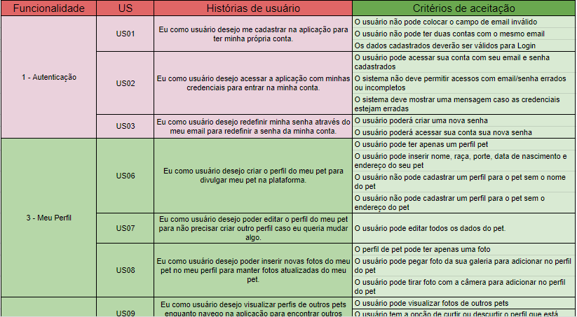

# PBB

O Product Backlog Building (PDD) é um método que facilita a elaboração e a criação de um Product Backlog.

## Objetivos

- Ajudar na construção de um BACKLOG de um
  forma efetiva e colaborativa.
- Construir um entendimento compartilhado do
  negócio do cliente, facilitando a descoberta e
  compreensão do produto.
- Buscar uma maneira de descrever a experiência
  do usuário com o produto.
- Facilitar a descoberta e escrita de User Stories.
- Priorizar por alinhamento de expectativas e
  metas.
- Ter como resultado um Product Backlog
  totalmente alinhado com o valor de negócio do
  cliente
  
<!--
## Modificações

- Estabelecida a correspondência entre os problemas relativos ao contexto do produto atual e os que as funcionalidades visam resolver.
- Tendo em vista a necesssária relação entre as funcionalidades do PBB e do Canvas MVP, anteriormente realizado, acrescentamos alguns PBI´s a mais para que tal relação se concretizasse em sua totalidade.
-->

<a href="https://miro.com/app/board/uXjVOKrgeb4=/">Link para o PBB Canvas </a>

# Critérios de Aceitação das US's do MVP

Os critérios de aceitação das User Stories do MVP1 podem ser visualizados através do link abaixo da imagem.

[Link para os critérios de aceitação](https://docs.google.com/spreadsheets/d/1SRrwxA64Fazjc2veKSibC7b3Cy8kGOiDQO4Pd-se34Y/edit?usp=sharing)