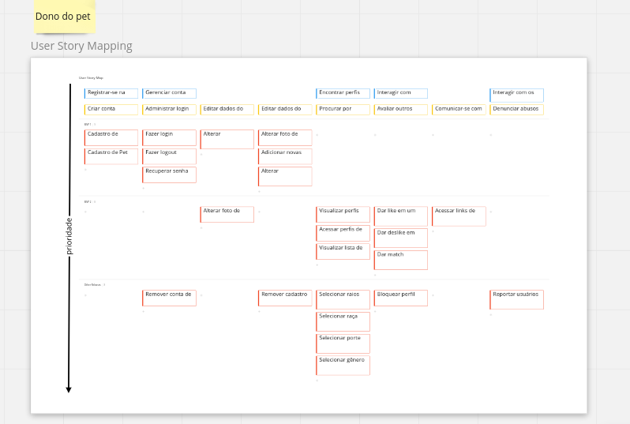

# User Story Mapping
O USM pode ser melhor analisado no **Miro** disponível no link abaixo da imagem.

<a href="https://miro.com/app/board/uXjVOKrgeb4=/">Link para o USM</a>

## Modificações

- Tendo em vista a necesssária clareza em relação aos objetivos presentes nos backbones do USM, alguns deles for renomeados a fim de proporcionar fácíl compreensão a respeito do que o usuário almeja realizar dentro da plataforma. 

