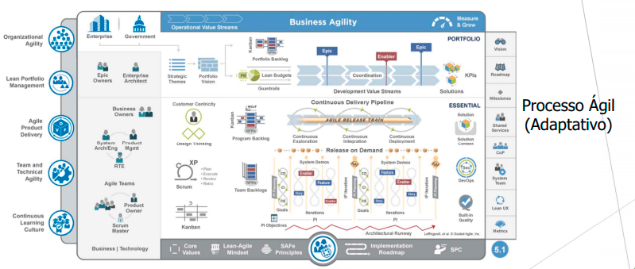

# Visão Geral do Produto

 

### 1 Declaração do problema

 
<table>
  <tr>
    <td> <b> O problema </b> </td> 
    <td>Os pets que sofrem distúrbios comportamentais e problemas de saúde causado pela falta de interação com outros animais ou pessoas. </td>
  </tr>
  <tr>
    <td> <b> Afeta </b> </td> 
    <td>Os pets que não possuem essas interações saudáveis, e acabam desenvolvendo comportamentos anormais e problemas de saúde como depressão ou ansiedade.</td>
  </tr>
  <tr>
    <td> <b> Cujo impacto é </b> </td> 
    <td>Uma má qualidade de vida do animal, que irá resultar num mal relacionamento entre o pet e seu dono.<td>
  </tr>
  <tr>
    <td> <b> Uma solução de sucesso seria </b> </td> 
    <td>Um aplicativo que possibilita a conexão entre donos de pets de uma determinada localidade. Dessa forma, os donos de pets podem combinar um encontro junto com seus pets, e finalmente, gerar uma interação saudável entre esses animais, evitando os problemas citados acima.</td>
  </tr>
</table>

 

### 1.2 Declaração de Posição do Produto

 
<table>
  <tr>
    <td> <b> Para </b> </td> 
    <td> Os donos de pets que possuem animais com problemas advindos da falta de interação dos seus pets com outros animais ou pessoas.
  </tr>
  <tr>
    <td> <b> Cujo impacto é </b> </td> 
    <td> Criar relações saudáveis entre os pets.
    </td>
  </tr>
  <tr>
    <td> <b> O Petspotters </b> </td> 
    <td>é uma rede social que conecta os donos de pets, para que esses donos promovam interações saudáveis entre seus pets. </td>
  </tr>
  <tr>
    <td> <b> Ao contrário </b> </td> 
    <td>do PetPonto, que o foco é em adoção e do CruzaPet, que o foco é reprodução</td>
  </tr>
  <tr>
    <td> <b> Nosso produto </b> </td> 
    <td> permite que os donos de pets possam cadastrar os seus pets no aplicativo, interagir com outros donos de pets curtindo o perfil de outros pets. Em caso de match, esses donos podem trocar mensaegns e marcar um encontro para que esses pets se conheçam, interajam e assim criem uma relação, melhorando a vida social dos animais. </td>
  </tr>
</table>

 

### 1.3 Objetivos do Produto

 

O objetivo principal do PetSpotters é que os donos de pets melhorem a vida social dos seus pets e fazer com que eles interajam com outros pets, tanto para passarem um dia no parque brincando, quanto para reproduzirem e gerarem lindos filhotes. E além disso, a rede de relacionamento acaba se estendendo para os donos também pois como são eles que administram as contas, indiretamente acabam conhecendo outros donos.

O objetivo principal do projeto PetSpotters é a melhora da qualidade de vida desses animais que possuem pouca ou nenhuma interação social, consequentemente, ocasionando em distúrbios comportamentais ou problemas de saúde como ansiedade e depressão. Sendo assim, o nosso foco é gerar interações sociais entre esses pets, seja relações de amizade ou até mesmo relações reprodutivas. 

Portanto, acreditamos que a criação de um aplicativo que possibilite os donos de pets a encontrarem novos amigos ou parceiros para seus animais irá contribuir significativamente nessa causa. E assim surge o app PetSpotter.

# Desenvolvimento de Software

### 2.1 Questões levantadas para a decisão do Desenvolvimento de Software

### 2.1.1 <b> Questões técnicas </b>
<table>
  <tr>
    <td> <b> Sistema </b> </td> 
    <td> Se trata de um sistema de relacionamento de pets, voltado para donos do pets. Portanto, não é um sistema muito robusto </td>
  </tr>
  <tr>
    <td> <b> Tipo </b> </td> 
    <td> Aplicativo de celular </td>
  </tr>
  <tr>
    <td> <b> Vida útil </b> </td> 
    <td> O produto possui vida útil indeterminada, enquanto houver público (donos de pets) e o problema em questão </td>
  </tr>
</table>

### 2.1.2 <b> Questões humanas </b>
<table>
  <tr>
    <td> <b> Time </b> </td> 
    <td> O time se trata de um conjunto de estudantes de Engenharia de Software, todos com experiência em desenvolvimento ágil </td>
  </tr>
  <tr>
    <td> <b> Distribuição </b> </td> 
    <td> O time está organizado em 5 integrantes. Vale destacar 1 desenvolvedora Front-end e 1 dev com experiência em desenvolvimento Mobile  </td>
  </tr>
  <tr>
    <td> <b> Tecnologia </b> </td> 
    <td> Experiência em React e React Native </td>
  </tr>
</table>

### 2.1.3 <b> Questões organizacionais </b>
<table>
  <tr>
    <td> <b> Contrato </b> </td> 
    <td> Pelo fato do projeto não englobar um contrato formal, não é necessário uma especificação ou projeto(design) bem detalhado </td>
  </tr>
  <tr>
    <td> <b> Entrega </b> </td> 
    <td> A entrega incremental é totalmente viável, por ser possível um feedback rápido em contato com o cliente (dono de pet) </td>
  </tr>
  <tr>
    <td> <b> Clientes </b> </td> 
    <td> Os clientes poderão estar em contato com o time de desenvolvimento para constantes melhorias no projeto </td>
  </tr>
  <tr>
    <td> <b> Cultura </b> </td> 
    <td> As diferenças culturais não irão interferir no desenvolvimento do projeto </td>
  </tr>
</table>

### 2.2 Metodologia baseada no Scrum

Dadas as questões levantadas, decidimos adotar um sistema ágil baseado no Scrum, e dessa forma, podemos gerenciar nosso projeto baseado em vários conceitos positivos para nós, como a entrega incremental, adaptabilidade a mudanças e flexibilidade de requisitos.
Além disso, nos escoramos em conceitos de Ian Sommerville, em seu livro “Engenharia de Software". Em seu trabalho, destaca a fase central do Scrum, chamada ciclos de sprint, como a mais inovadora característica de tal abordagem. "Um sprint do Scrum é uma unidade de planejamento na qual o trabalho a ser feito é avaliado, os recursos para o desenvolvimento são selecionados e o software é implementado".
Outro fator levantado por Sommerville e que possuiu certo peso em nossa decisão foi a descentralização do poder de decisões. Toda a equipe tem poder para tomar decisões, sendo o Scrum Master apenas um vetor de fluidez para o andamento do projeto: “A ideia por trás do Scrum é que toda a equipe deve ter poderes para tomar decisões, de modo que o termo ‘gerente de projeto’ tem sido deliberadamente evitado. Pelo contrário, o ‘Scrum Master’ é um facilitador, que organiza reuniões diárias, controla o backlog de trabalho, registra decisões, mede o progresso comparado ao backlog e se comunica com os clientes e a gerência externa à equipe”. 
Além do SM, nossa abordagem de desenvolvimento de software contará com o Product Owner e o Dev Team, que serão papéis rotativos entre os integrantes do projeto. 
Nosso modelo irá contar com os seguintes eventos e artefatos:

    • Sprints
    • Sprint Planning/Review
    • Sprint Retrospectivse
    • Reuniões Semanais
    • Product Backlog
    • Sprint Backlog

Portanto, decidimos nos basear no Scrum, pelos diversos fatores que nos beneficiam em aspectos de flexibilidade, entrega, feedback contínuo, descentralização de poder e dinamismo.
Portanto, decidimos nos basear no Scrum, pelos diversos fatores que nos beneficiam em aspectos de flexibilidade, entrega, feedback contínuo, descentralização de poder e dinamismo.

# Abordagem de Engenharia de Requisitos

Quanto à abordagem de Engenharia de Requisitos a ser utilizada, teremos a Abordagem Ágil como ferramenta norteadora a qual será de extrema importância no que diz respeito à realização das quatro principais atividades dentro dos processos de engenharia de requisitos: avaliação da utilidade do sistema para a empresa (estudo de viabilidade), descoberta de requisitos (elicitação e análise), conversão de tais requisitos em alguma forma-padrão (especificação), e verificação se os requisitos realmente definem o sistema que o cliente quer (validação).

  

  

### 3.1 Elicitação de Requisitos

| Atividade                                 | Método        | Ferramenta        |
| ----------------------------------------- | ------------- | ----------------- |
| Descoberta de requisitos                  | Brainstorming | Plataforma "Miro" |
| Classificação e organização de requisitos | Cenários      | Plataforma "Miro" |
| Priorização e negociação de requisitos    | Casos de Uso  | Plataforma "Miro" |s

### 3.2 Análise de Requisitos

| Atividade                                                      | Método                               | Ferramenta        |
| -------------------------------------------------------------- | ------------------------------------ | ----------------- |
| Definição do quão implementáveis são os requisistos elicitados | Casos de Uso, Cenários ou Storyboard | Plataforma "Miro" |

### 3.3 Documentação de Requisitos

| Atividade                                                         | Método                             | Ferramenta                                                                               |
| ----------------------------------------------------------------- | ---------------------------------- | ---------------------------------------------------------------------------------------- |
| Especificação de Requisitos de Software (de Usuário e de Sistema) | Linguagem Natural, Notação Gráfica | Software para edição de textos e criação de formulários, modelos gráficos ou matemáticos |
<!--
Para documentar vão usar casos de uso, cenários e storyborads? É isso?
-->
### 3.4 Verificação e Validação de Requisitos

| Atividade      | Método                                                                       | Ferramenta               |
| -------------- | ---------------------------------------------------------------------------- | ------------------------ |
| Planejamento   | Scrum                                                                        | Google Meet, Google Docs |
| Apresentação   | A cada sprint será feita uma apresentação de cada autor e seu trabalho feito | Google Meet              |
| Preparação | Um moderador e o autor da sprint se reunem e determinam se a sprint está pronta para ser revisada | Google Meet, Google Docs |
| Reunião        | Semanais com os participantes do grupo                                         | Google Meet              |
| Correção       | Cada entrega será feita uma avaliação e depois uma segunda entrega           | Google Meet              |
| Acompanhamento | Semanais para verificar a corretabilidade do produto                           | Google Meet              |
### 3.5 Gerenciamento de Requisitos
| Atividade                                                   | Método                           | Ferramenta                |
| ----------------------------------------------------------- | -------------------------------- | ------------------------- |
| Adaptação da equipe com as possíveis mudanças de requisitos | Revisão frequente dos requisitos | Documentação, Google Meet |

# Escopo do Produto

 

### 3.1 Requisitos funcionais
- [RF01] O sistema deverá permitir o cadastro do usuário
- [RF02] O sistema deverá solicitar login para o acesso
- [RF03] O sistema deverá permitir a redefinição de senha
- [RF04] O sistema deverá prover um perfil ao usuário
- [RF05] O sistema deverá permitir a edição do perfil do usuário
- [RF06] O sistema deverá permitir a inserção de novas fotos do pet do usuário
- [RF07] O sistema deverá permitir a alteração de preferências de localização, raça, porte e gênero dos pets
- [RF08] O sistema deverá exibir um perfil para o usuário decidir se possui ou não interesse no pet
- [RF09] O sistema deverá dar um match quando dois usuários gostarem do pet um do outro
- [RF10] O sistema deverá exibir uma lista com os matches do usuário
- [RF11] O sistema deverá permitir que o usuário busque por um match específico
- [RF12] O sistema deverá permitir que os usuários que derem match troquem mensagens entre si
- [RF13] O sistema deverá permitir que um usuário reporte o outro caso haja algum problema

### 3.2 Requisitos não funcionais 

- [RNF01] O app deverá estar disponível 24 horas, 7 dias por semana, ou o mais próximo possível disso
- [RNF02] O app deverá ser compatível com a plataforma Android 
- [RNF03] O app deverá proporcionar segurança ao guardar os dados do usuário
- [RNF04] O app deverá apresentar linguagem de fácil entendimento
- [RNF05] O app deverá possuir interface intuitiva e de fácil compreensão
- [RNF06] O app deverá apresentar um layout responsivo
- [RNF07] O sistema não apresentará aos usuários quaisquer dados de cunho privativo 
- [RNF08] O sistema deverá ser desenvolvido na linguagem Javascript juntamente com o framework de desenvolvimento mobile React Native, para o front-end. Para o back-end, o sistema deverá ser desenvolvido com o auxílio das tecnologias NodeJS e rest API axios.
- [RNF09] O sistema deverá fazer uso da tecnologia Firebase para o processo de implementação da base de dados.

 

# Requisitos com padrão SAFe
<!--
### Comentários do professor: 
Essa estrutura precisa ser revista. Existem vários relacionamentos 1..1 entre features e histórias. Por favor, corrijam

OBS: As mudanças foram os valores de negócios e coluna US foi trocada de lugar
-->

<a href="https://docs.google.com/spreadsheets/d/1-uMMVV517KptQm8iZ8H7HGmlVPqYcNHyairslKIF8ZA/edit#gid=0">Link para o SAFe</a>

# Mínimo Produto Viável (MVP)

## Canvas MVP

O Canvas MVP da plataforma PetStoppers foi realizado e obtivemos a seguinte configuração incial:
<!--
### Comentários do professor:
A jornada refere-se ao que a persona faz, atualmente, e não o que ela irá fazer com a utilização da solução. Nesse momento, não se tem nem os requisitos funcionais. Esses são extraídos, justamente, das jornadas

A nomemclatura e conteúdo de fundionalidades está diferente da seção 1.4.1. Requisitos Funcionais do documento de Visão.

cada resultado esperado deve ser passível de mensuração. Como mensurar, por exemplo, "Melhorar vida social dos pets"?

OBS: O que mudou aqui foi as JORNADAS
-->

<a href="https://miro.com/app/board/uXjVOKrgeb4=/">Link para o Canvas no Miro</a>
