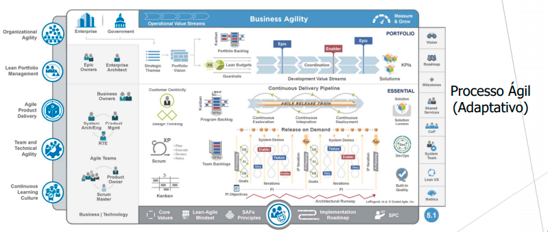

# 3. Abordagem de Engenharia de Requisitos

Quanto à abordagem de Engenharia de Requisitos a ser utilizada, teremos a Abordagem Ágil como ferramenta norteadora a qual será de extrema importância no que diz respeito à realização das quatro principais atividades dentro dos processos de engenharia de requisitos: avaliação da utilidade do sistema para a empresa (estudo de viabilidade), descoberta de requisitos (elicitação e análise), conversão de tais requisitos em alguma forma-padrão (especificação), e verificação se os requisitos realmente definem o sistema que o cliente quer (validação).

Qual a referência desse texto? Faltou *gerenciamento de requisitos*. Qual a relação desse texto com a imagem do SAF, apresentada, a seguir?

 

 
 
 

## 3.1 Elicitação de Requisitos

Ajustem os nomes de todas as atividades, por exemplo: Descobrir, Definir, Planejar, Classificar, Organizar, etc.

| Atividade                                 | Método        | Ferramenta        |
| ----------------------------------------- | ------------- | ----------------- |
| Descoberta de requisitos                  | Brainstorming | Plataforma "Miro" |
| Classificação e organização de requisitos | Cenários      | Plataforma "Miro" |
| Priorização e negociação de requisitos    | Casos de Uso  | Plataforma "Miro" |

Classificação e organização de requisitos e Priorização e negociação de requisitos não são ELICITAÇÃO

## 3.2 Análise de Requisitos

| Atividade                                                      | Método                               | Ferramenta        |
| -------------------------------------------------------------- | ------------------------------------ | ----------------- |
| Definição do quão implementáveis são os requisistos elicitados | Casos de Uso, Cenários ou Storyboard | Plataforma "Miro" |

Vocês vão utilizar casos de uso, junto com uma abordagem ágil?

## 3.3 Documentação de Requisitos

| Atividade                                                         | Método                             | Ferramenta                                                                               |
| ----------------------------------------------------------------- | ---------------------------------- | ---------------------------------------------------------------------------------------- |
| Especificação de Requisitos de Software (de Usuário e de Sistema) | Linguagem Natural, Notação Gráfica | Software para edição de textos e criação de formulários, modelos gráficos ou matemáticos |

Para documentar vão usar casos de uso, cenários e storyborads? É isso?

## 3.4 Verificação e Validação de Requisitos

| Atividade      | Método                                                                       | Ferramenta               |
| -------------- | ---------------------------------------------------------------------------- | ------------------------ |
| Planejamento   | Scrum                                                                        | Google Meet, Google Docs |
| Apresentação   | A cada sprint será feita uma apresentação de cada autor e seu trabalho feito | Google Meet              |
| Preparação | Um moderador e o autor da sprint se reunem e determinam se a sprint está pronta para ser revisada | Google Meet, Google Docs |
| Reunião        | Semanais com os participantes do grupo                                         | Google Meet              |
| Correção       | Cada entrega será feita uma avaliação e depois uma segunda entrega           | Google Meet              |
| Acompanhamento | Semanais para verificar a corretabilidade do produto                           | Google Meet              |

## 3.5 Gerenciamento de Requisitos

| Atividade                                                   | Método                           | Ferramenta                |
| ----------------------------------------------------------- | -------------------------------- | ------------------------- |
| Adaptação da equipe com as possíveis mudanças de requisitos | Revisão frequente dos requisitos | Documentação, Google Meet |

O que é "Adaptação da equipe com as possíveis mudanças de requisitos", efetivamente?
